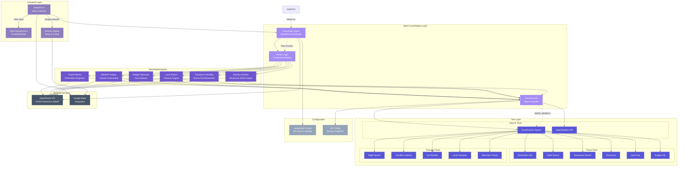

# System Architecture

```mermaid
graph TB
    subgraph "Frontend Layer"
        UI[Streamlit UI<br/>Velura Interface]
        UI --> |User Input| ST[State Management<br/>TravelPlanState]
        UI --> |Display Results| RD[Results Display<br/>Maps & Charts]
    end

    subgraph "Agent Coordination Layer"
        COORD[Coordinator Agent<br/>Workflow Orchestrator]
        ROUTER[Router Logic<br/>Conditional Routing]
        EXEC[Tool Executor<br/>Search Handler]
    end

    subgraph "Specialized Agents"
        TA[Travel Advisor<br/>Destination Expertise]
        WA[Weather Analyst<br/>Climate Forecasting]
        BO[Budget Optimizer<br/>Cost Analysis]
        LE[Local Expert<br/>Cultural Insights]
        TM[Transport & Mobility<br/>End-to-End Movement]
        IP[Itinerary Planner<br/>Structured JSON Output]
    end

    subgraph "Tool Layer"
        subgraph "Search Tools"
            DDG[DuckDuckGo Search]
            WEATHER[OpenWeather API]
        end
        
        subgraph "Travel Tools"
            DEST[Destination Info]
            HOTELS[Hotel Search]
            REST[Restaurant Search]
            ATTRACT[Attractions]
            TIPS[Local Tips]
            BUDGET[Budget Info]
        end
        
        subgraph "Transport Tools"
            FLIGHTS[Flight Search]
            TRAINS[Train/Bus Options]
            RENTAL[Car Rentals]
            LOCAL[Local Transport]
            TRANSIT[Real-time Transit]
        end
    end

    subgraph "External Services"
        OPENROUTER[OpenRouter API<br/>NVIDIA Nemotron Model]
        MAPS[Google Maps<br/>Integration]
    end

    subgraph "Configuration"
        CONFIG[LangGraph Config<br/>API Keys & Settings]
        API[API Config<br/>Service Endpoints]
    end

    %% Connections
    UI --> COORD
    COORD --> ROUTER
    ROUTER --> TA
    ROUTER --> WA
    ROUTER --> BO
    ROUTER --> LE
    ROUTER --> TM
    ROUTER --> IP
    
    TA --> EXEC
    WA --> EXEC
    BO --> EXEC
    LE --> EXEC
    TM --> EXEC
    IP --> EXEC
    
    EXEC --> DDG
    EXEC --> WEATHER
    
    DDG --> DEST
    DDG --> HOTELS
    DDG --> REST
    DDG --> ATTRACT
    DDG --> TIPS
    DDG --> BUDGET
    DDG --> FLIGHTS
    DDG --> TRAINS
    DDG --> RENTAL
    DDG --> LOCAL
    DDG --> TRANSIT
    
    COORD --> OPENROUTER
    TA --> OPENROUTER
    WA --> OPENROUTER
    BO --> OPENROUTER
    LE --> OPENROUTER
    TM --> OPENROUTER
    IP --> OPENROUTER
    
    UI --> MAPS
    RD --> MAPS
    
    COORD --> CONFIG
    EXEC --> API

    %% Styling
    classDef frontend fill:#8e7dbe,stroke:#fff,color:#fff
    classDef coordination fill:#a48cf4,stroke:#fff,color:#fff
    classDef agents fill:#6e56cf,stroke:#fff,color:#fff
    classDef tools fill:#5856d6,stroke:#fff,color:#fff
    classDef external fill:#475569,stroke:#fff,color:#fff
    classDef config fill:#94a3b8,stroke:#fff,color:#fff
    
    class UI,ST,RD frontend
    class COORD,ROUTER,EXEC coordination
    class TA,WA,BO,LE,TM,IP agents
    class DDG,WEATHER,DEST,HOTELS,REST,ATTRACT,TIPS,BUDGET,FLIGHTS,TRAINS,RENTAL,LOCAL,TRANSIT tools
    class OPENROUTER,MAPS external
    class CONFIG,API config

    %% Workflow Arrows
    COORD -.->|Flow Control| ROUTER
    EXEC -.->|NEED_SEARCH| DDG
    AGENTS -.->|Return to| COORD
```